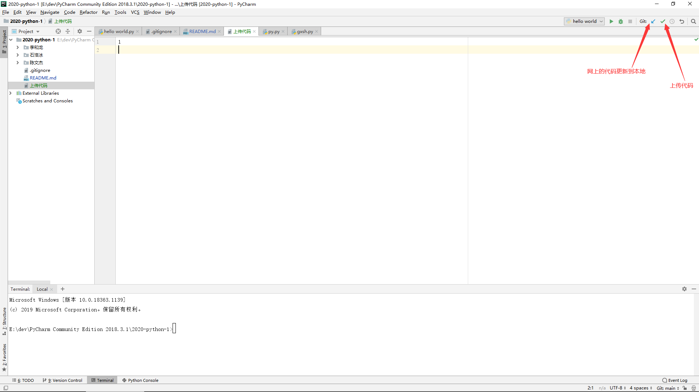
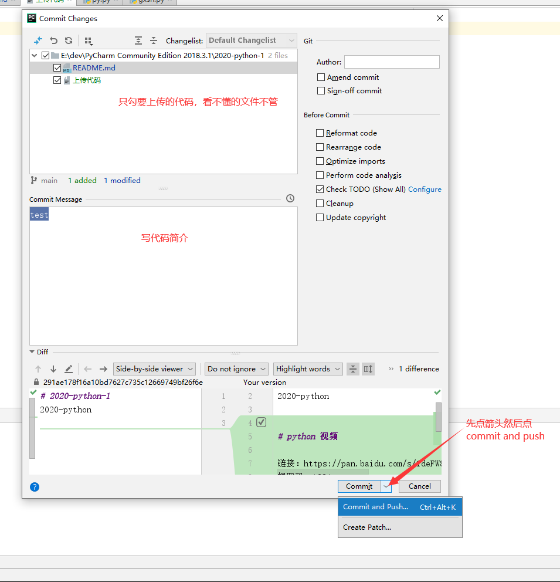
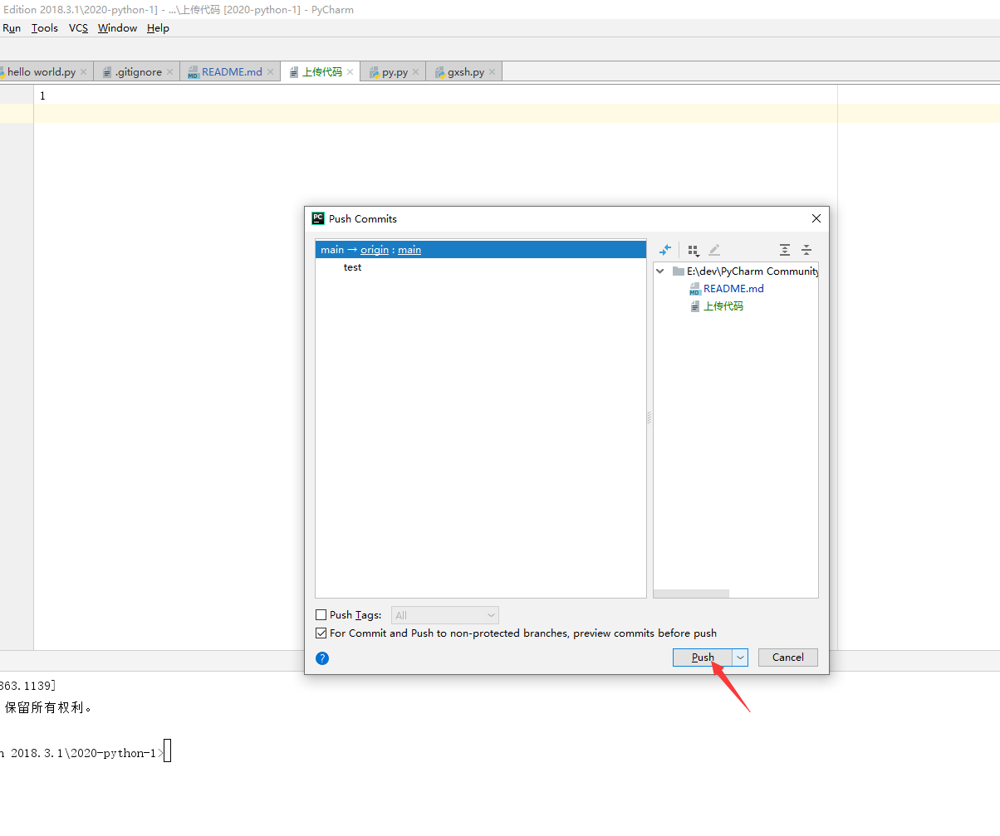

# 2020-python-1
2020-python

# python 视频

链接：https://pan.baidu.com/s/1deFW86g-ksVDXwlp8YDMpQ 
提取码：1234 

# 上传代码
1.**更新代码按钮点了下一个窗口直接点 “OK”，不管其他选项**

  

2.**代码简介必须写，勾文件的时候可能会让你选很多.xml文件，都不要点，只选你自己写的代码**

  

3.

